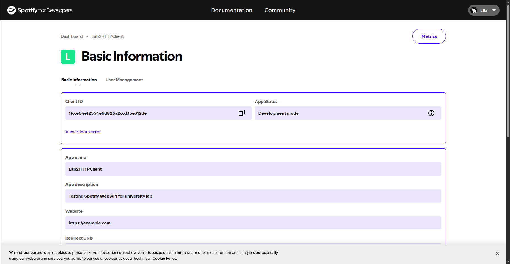
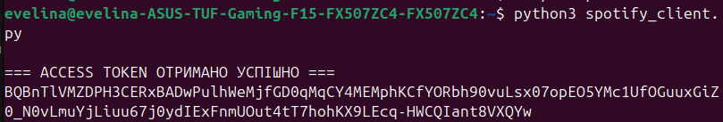
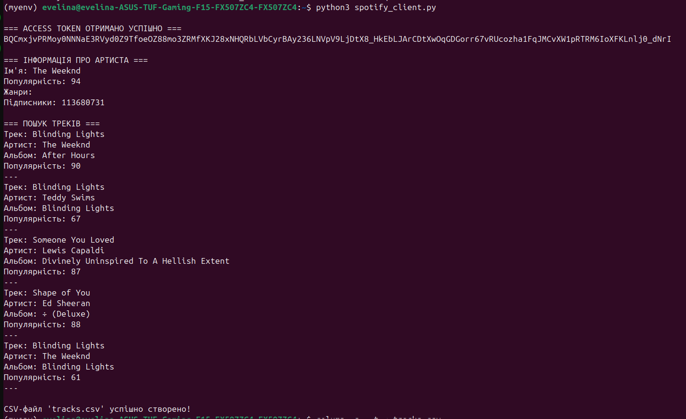

# Lab 2 — HTTP Client (Spotify Web API)

## 1. Мета роботи
Отримати навички роботи з OAuth 2.0 Client Credentials Flow, виконання HTTP‑запитів та обробки даних Spotify Web API.

---

## 2. Опис API

### 2.1. Spotify Web API
Spotify Web API — REST API для отримання інформації про артистів, альбоми, треки.  
Документація: https://developer.spotify.com/documentation/web-api

---

## 2.2. Реєстрація застосунку

Створено застосунок **Lab2HTTPClient** у Spotify Developer Dashboard.  
Було отримано:  
- Client ID  
- Client Secret  

---

## 2.3. Скріншоти

### 1. Основна інформація застосунку  


### 2. Отримання Access Token  


### 3. Інформація про артиста  


### 4. Пошук треків та вивід результатів  


---

## 3. Код програми

```python
import requests
import base64
import pandas as pd

CLIENT_ID = "ВАШ_CLIENT_ID"
CLIENT_SECRET = "ВАШ_CLIENT_SECRET"

def get_access_token():
    url = "https://accounts.spotify.com/api/token"
    auth_str = f"{CLIENT_ID}:{CLIENT_SECRET}"
    b64_auth = base64.b64encode(auth_str.encode()).decode()

    headers = {"Authorization": f"Basic {b64_auth}"}
    data = {"grant_type": "client_credentials"}
    response = requests.post(url, headers=headers, data=data)
    return response.json().get("access_token")

def get_artist_info(token, artist_id):
    url = f"https://api.spotify.com/v1/artists/{artist_id}"
    headers = {"Authorization": f"Bearer {token}"}
    return requests.get(url, headers=headers).json()

def search_tracks(token, query):
    url = f"https://api.spotify.com/v1/search?q={query}&type=track&limit=5"
    headers = {"Authorization": f"Bearer {token}"}
    return requests.get(url, headers=headers).json()

def save_to_csv(data):
    tracks = []
    for item in data["tracks"]["items"]:
        tracks.append({
            "name": item["name"],
            "artist": item["artists"][0]["name"],
            "album": item["album"]["name"],
            "popularity": item["popularity"]
        })

    df = pd.DataFrame(tracks)
    df.to_csv("tracks.csv", index=False)
    print("CSV-файл 'tracks.csv' створено!")

def main():
    token = get_access_token()
    print("== ACCESS TOKEN ОТРИМАНО ==")
    print(token)

    artist = get_artist_info(token, "1Xyo4u8uXC1ZmMpatF05PJ")
    print("\n=== ІНФОРМАЦІЯ ПРО АРТИСТА ===")
    print("Ім'я:", artist["name"])
    print("Популярність:", artist["popularity"])
    print("Підписники:", artist["followers"]["total"])

    result = search_tracks(token, "blinding lights")
    save_to_csv(result)

if __name__ == "__main__":
    main()
```

---

## 4. Висновки

У результаті роботи:
- реалізовано авторизацію через OAuth 2.0 Client Credentials Flow;
- отримано інформацію про артиста;
- виконано пошук треків;
- отримані дані збережено у CSV-файл;
- підготовлено звіт з ілюстраціями.

---

